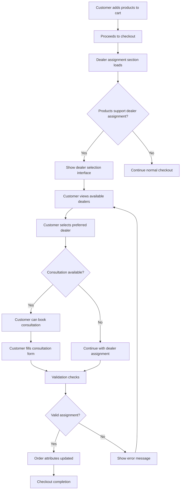

# Starboard Dealer Assignment - Implementation Guide

## Overview

This Shopify Plus checkout customization enables customers purchasing Starboard watersports equipment to select an authorized dealer for expert support, consultation, and local service. The system integrates seamlessly into the checkout flow and provides a comprehensive dealer assignment and consultation booking experience.

## Architecture

### System Components

1. **Checkout UI Extension** (`dealer-assignment`)
   - Customer-facing interface for dealer selection
   - Consultation booking functionality
   - Real-time dealer search and filtering
   - Product compatibility checking

2. **Validation Function** (`dealer-validation`)
   - Server-side validation of dealer assignments
   - Geographic coverage verification
   - Product-dealer compatibility checks
   - Consultation booking validation

3. **Backend Services**
   - Dealer database management
   - Geolocation services
   - Consultation scheduling API
   - Order attribute management

4. **Styling System**
   - Starboard brand-compliant CSS
   - Responsive design for all devices
   - Accessibility-focused components

## Detailed Flow

### 1. Customer Journey



### 2. Technical Implementation

#### A. Dealer Selection Logic

```typescript
// Product category detection
const getProductCategories = (cartLines) => {
  const categories = new Set();
  cartLines.forEach(line => {
    const productType = line.merchandise.product?.productType?.toLowerCase();
    if (productType?.includes('windsurf')) categories.add('windsurf');
    if (productType?.includes('sup') || productType?.includes('paddle')) categories.add('sup');
    if (productType?.includes('wing') || productType?.includes('foil')) categories.add('wingfoil');
  });
  return Array.from(categories);
};

// Dealer filtering and ranking
const rankDealers = (dealers, productCategories, customerLocation) => {
  return dealers
    .filter(dealer => 
      productCategories.some(cat => dealer.supportedProducts.includes(cat))
    )
    .sort((a, b) => {
      // Prioritize dealers supporting all products
      const aSupportsAll = productCategories.every(cat => a.supportedProducts.includes(cat));
      const bSupportsAll = productCategories.every(cat => b.supportedProducts.includes(cat));
      if (aSupportsAll && !bSupportsAll) return -1;
      if (!aSupportsAll && bSupportsAll) return 1;
      
      // Then sort by distance and rating
      if (a.distance && b.distance) return a.distance - b.distance;
      return b.rating - a.rating;
    });
};
```

#### B. Validation System

The validation function runs on every checkout attempt and ensures:

1. **Dealer Compatibility**: Selected dealer can service all products in cart
2. **Geographic Coverage**: Dealer services the customer's delivery area
3. **Consultation Validity**: Booking details are complete and valid
4. **Business Rules**: Custom validation rules per merchant configuration

```typescript
// Validation example
const validateDealerAssignment = (cart, assignment) => {
  const errors = [];
  
  // Check dealer capabilities
  const productCategories = extractProductCategories(cart);
  const dealer = fetchDealerData(assignment.dealerId);
  
  const unsupportedProducts = productCategories.filter(
    category => !dealer.supportedProducts.includes(category)
  );
  
  if (unsupportedProducts.length > 0) {
    errors.push({
      message: `Selected dealer cannot service ${unsupportedProducts.join(', ')} products`,
      target: 'cart'
    });
  }
  
  return errors;
};
```

#### C. Data Management

Order attributes store all dealer assignment data:

```json
{
  "dealer_assignment_data": {
    "dealerId": "dealer_123",
    "dealerName": "Pacific Windsurf Center",
    "dealerContact": "+1-415-555-0123 | info@pacificwindsurf.com",
    "consultation": {
      "type": "product_selection",
      "preferredDate": "2024-01-15",
      "preferredTime": "14:00",
      "contactMethod": "phone",
      "notes": "Need help choosing the right board size"
    },
    "deliveryInstructions": "Call before delivery",
    "setupPreference": "dealer_setup",
    "timestamp": "2024-01-10T10:30:00Z"
  }
}
```

## Configuration Options

### Merchant Settings

Merchants can configure the system through the Shopify admin:

1. **Dealer Database**
   - Upload dealer information via CSV
   - API integration for real-time dealer data
   - Manual dealer management interface

2. **Business Rules**
   - Require dealer selection (mandatory/optional)
   - Geographic coverage areas
   - Product-dealer compatibility matrix
   - Consultation availability settings

3. **Display Options**
   - Maximum dealers shown by default
   - Dealer ranking criteria
   - Consultation booking features
   - Custom messaging and branding

### Extension Settings

```toml
[extensions.settings]
# Core functionality
enable_consultation_booking = true
require_dealer_selection = false
max_dealers_displayed = 3

# Data sources
dealer_api_endpoint = "https://api.starboard.com/dealers"
enable_geolocation = true

# Product configuration
supported_product_types = [
  "Windsurf Boards",
  "SUP Boards", 
  "Wingfoil Equipment",
  "Windsurf Sails",
  "SUP Paddles"
]
```

## Integration Points

### 1. Order Management

When an order is placed with dealer assignment:

```javascript
// Order webhook handler
const handleOrderCreated = (order) => {
  const dealerData = JSON.parse(
    order.attributes.find(attr => attr.key === 'dealer_assignment_data')?.value || '{}'
  );
  
  if (dealerData.dealerId) {
    // Notify assigned dealer
    notifyDealer(dealerData.dealerId, order);
    
    // Schedule consultation if requested
    if (dealerData.consultation) {
      scheduleConsultation(dealerData.consultation, order);
    }
    
    // Update dealer assignment records
    updateDealerAssignmentHistory(dealerData.dealerId, order.id);
  }
};
```

### 2. Dealer Notification System

```javascript
// Dealer notification service
const notifyDealer = async (dealerId, order) => {
  const dealer = await fetchDealer(dealerId);
  const emailData = {
    to: dealer.email,
    subject: `New Starboard Order Assignment - ${order.name}`,
    template: 'dealer-assignment',
    data: {
      dealerName: dealer.name,
      orderNumber: order.name,
      customerName: order.customer.name,
      products: order.line_items,
      totalAmount: order.total_price,
      consultation: order.consultation_data
    }
  };
  
  await sendEmail(emailData);
  
  // Also send SMS if dealer prefers it
  if (dealer.notifications.sms) {
    await sendSMS(dealer.phone, `New Starboard order ${order.name} assigned to you`);
  }
};
```

### 3. Customer Communication

```javascript
// Customer confirmation email enhancement
const enhanceOrderConfirmation = (order) => {
  const dealerData = extractDealerData(order);
  
  if (dealerData) {
    return {
      ...order,
      dealer_info: {
        name: dealerData.dealerName,
        contact: dealerData.dealerContact,
        consultation: dealerData.consultation,
        message: `Your order has been assigned to ${dealerData.dealerName}, an authorized Starboard dealer who will provide expert support.`
      }
    };
  }
  
  return order;
};
```

## Analytics & Reporting

### Key Metrics

1. **Dealer Assignment Rate**: % of orders with dealer assignment
2. **Consultation Booking Rate**: % of dealer assignments with consultations
3. **Dealer Performance**: Order volume, customer satisfaction per dealer
4. **Geographic Distribution**: Dealer coverage analysis
5. **Product Category Trends**: Assignment patterns by product type

### Implementation

```javascript
// Analytics tracking
const trackDealerAssignment = (event, data) => {
  // Google Analytics
  gtag('event', 'dealer_assignment', {
    event_category: 'checkout',
    event_label: event,
    value: data.dealerId,
    custom_map: {
      dealer_id: data.dealerId,
      product_categories: data.productCategories.join(','),
      consultation_requested: data.consultation ? 'yes' : 'no'
    }
  });
  
  // Shopify Analytics
  analytics.track('Dealer Assignment', {
    dealerId: data.dealerId,
    dealerName: data.dealerName,
    productCategories: data.productCategories,
    consultationRequested: !!data.consultation,
    orderValue: data.orderValue
  });
};
```

## Testing Strategy

### 1. Unit Tests

```javascript
describe('Dealer Selection Logic', () => {
  test('filters dealers by product compatibility', () => {
    const dealers = mockDealers;
    const productCategories = ['windsurf', 'sup'];
    const filtered = filterDealersByProducts(dealers, productCategories);
    
    expect(filtered).toHaveLength(2);
    expect(filtered[0].supportedProducts).toContain('windsurf');
  });
  
  test('ranks dealers by distance and rating', () => {
    const dealers = mockDealers;
    const ranked = rankDealers(dealers, ['sup'], mockLocation);
    
    expect(ranked[0].distance).toBeLessThan(ranked[1].distance);
  });
});
```

### 2. Integration Tests

```javascript
describe('Checkout Flow', () => {
  test('completes checkout with dealer assignment', async () => {
    await addProductToCart('windsurf-board-123');
    await proceedToCheckout();
    await selectDealer('dealer_1');
    await bookConsultation({
      type: 'product_selection',
      date: '2024-01-15',
      time: '14:00'
    });
    
    const order = await completeCheckout();
    expect(order.attributes).toHaveProperty('dealer_assignment_data');
  });
});
```

### 3. Performance Tests

- Load testing with 1000+ dealers
- Response time optimization
- Memory usage monitoring
- API rate limiting tests

## Deployment

### 1. Staging Environment

```bash
# Deploy to staging
shopify app deploy --environment=staging

# Run tests
npm run test:integration

# Performance benchmarking
npm run test:performance
```

### 2. Production Deployment

```bash
# Production deployment
shopify app deploy --environment=production

# Monitor deployment
npm run monitor:deployment

# Rollback plan
shopify app rollback --version=previous
```

### 3. Monitoring

```javascript
// Health check endpoint
app.get('/health', (req, res) => {
  const health = {
    status: 'healthy',
    timestamp: new Date().toISOString(),
    services: {
      database: checkDatabaseConnection(),
      dealerApi: checkDealerApiStatus(),
      geolocation: checkGeolocationService()
    }
  };
  
  res.json(health);
});
```

## Troubleshooting

### Common Issues

1. **Dealers Not Loading**
   - Check API connectivity
   - Verify dealer database status
   - Review geolocation permissions

2. **Validation Errors**
   - Examine product-dealer compatibility matrix
   - Check geographic coverage settings
   - Review consultation booking logic

3. **Performance Issues**
   - Optimize dealer queries
   - Implement caching strategies
   - Review API rate limits

### Debugging Tools

```javascript
// Debug mode for development
if (process.env.NODE_ENV === 'development') {
  window.starboardDebug = {
    dealers: dealers,
    productCategories: productCategories,
    validationErrors: validationErrors,
    logs: debugLogs
  };
}
```

## Support & Maintenance

### Regular Tasks

1. **Dealer Data Sync**: Weekly updates from dealer management system
2. **Performance Monitoring**: Daily checks on response times and error rates
3. **Analytics Review**: Monthly analysis of assignment patterns and trends
4. **User Feedback**: Quarterly review of customer and dealer feedback

### Contact Information

- **Technical Support**: dev@star-board.com
- **Business Support**: sales@star-board.com
- **Emergency Contact**: +1-800-STARBOARD

This implementation provides a comprehensive dealer assignment system that enhances the customer experience while providing valuable business insights for Starboard and their dealer network.